# Furni – Full Stack Django E-Commerce Website

## Overview

Furni is a full-stack e-commerce web application developed using **Python** and **Django**. The platform provides separate dashboards for **Customers**, **Sellers**, and **Administrators**, enabling complete online shopping and store management functionality.

The project follows a role-based architecture and includes product management, shopping cart, checkout, order management, seller analytics, and an administrative control panel.

---

## Features

### Customer Module

* User Registration & Login
* Browse Products
* Search Products
* Shopping Cart
* Quantity Management
* Secure Checkout
* Order Placement
* My Orders
* Order Details
* Invoice Generation
* Contact Us

---

### Seller Module

* Seller Authentication
* Seller Dashboard
* Product Management (CRUD)
* Order Management
* Order Status Updates
* Seller Profile Management
* Sales Analytics
* Daily Order Statistics

---

### Admin Module

* Admin Dashboard
* Customer Management
* Seller Management
* Product Management
* Order Management
* Contact Management
* Platform Analytics

---

## Tech Stack

### Backend

* Python
* Django
* Django ORM

### Frontend

* HTML5
* CSS3
* Bootstrap 5
* JavaScript
* Chart.js

### Database

* SQLite3

---

## Project Highlights

* Role-Based Authentication
* Responsive UI Design
* Shopping Cart System
* Product CRUD Operations
* Order Processing Workflow
* Seller Analytics Dashboard
* Admin Control Panel
* Dynamic Search
* Pagination
* Stock Management
* Order Status Tracking

---

## Installation

Clone the repository

```bash
git clone https://github.com/mahekvadadoriya/furni-django-ecommerce.git
```

Move into the project

```bash
cd furni-django-ecommerce
```

Create Virtual Environment

```bash
python -m venv env
```

Activate Environment

### Windows

```bash
env\Scripts\activate
```

### Linux / macOS

```bash
source env/bin/activate
```

Install Dependencies

```bash
pip install -r requirements.txt
```

Run Migrations

```bash
python manage.py migrate
```

Run Server

```bash
python manage.py runserver
```

---

## Future Enhancements

* Online Payment Gateway Integration
* Product Reviews & Ratings
* Wishlist
* Email Notifications
* Sales Reports (PDF & Excel)
* Inventory Alerts
* REST API
* Docker Deployment

---

## Developer

**Mahek Vadadoriya**

Python | Django | Full Stack Developer

---

## License

This project is developed for educational and portfolio purposes.

## 📸 Project Screenshots

### 🏠 Home Page

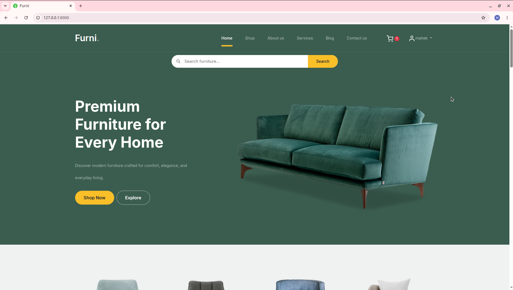

---

### 🛍️ Shop Page

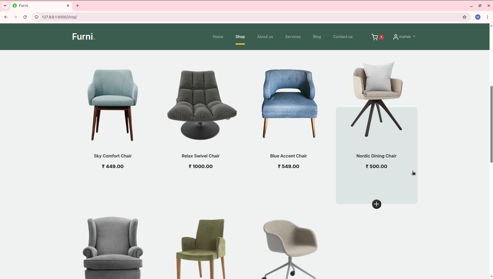

---

### 🛒 Shopping Cart

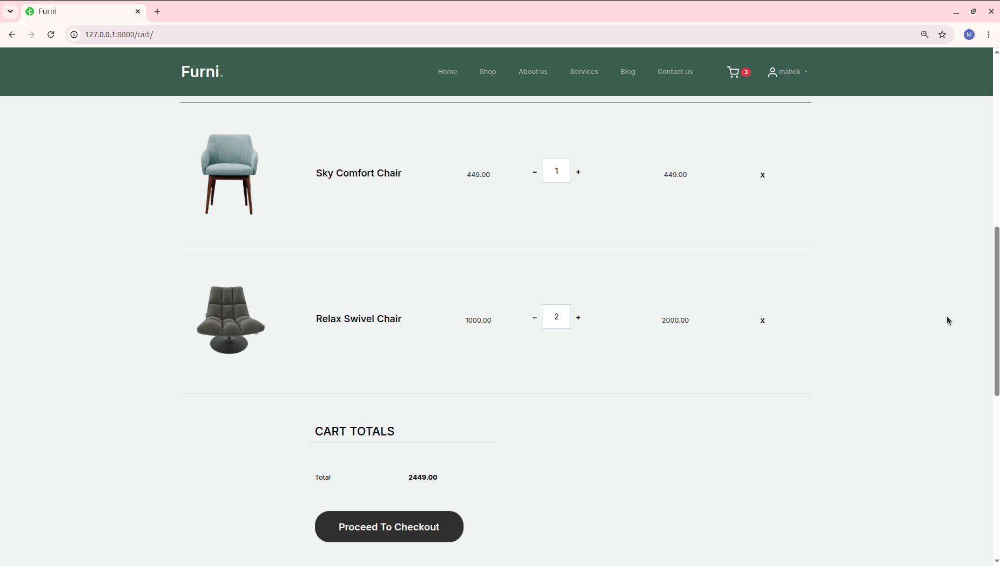

---

### 📦 My Orders

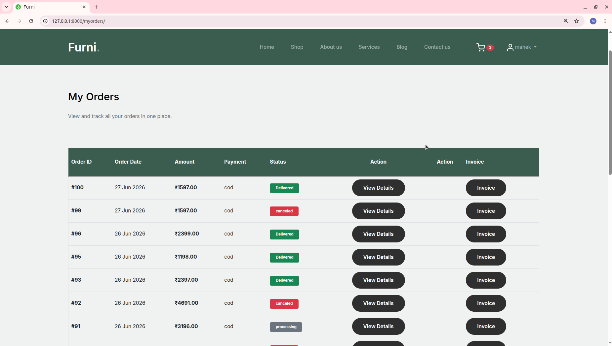

---

### 👨‍💼 Seller Dashboard

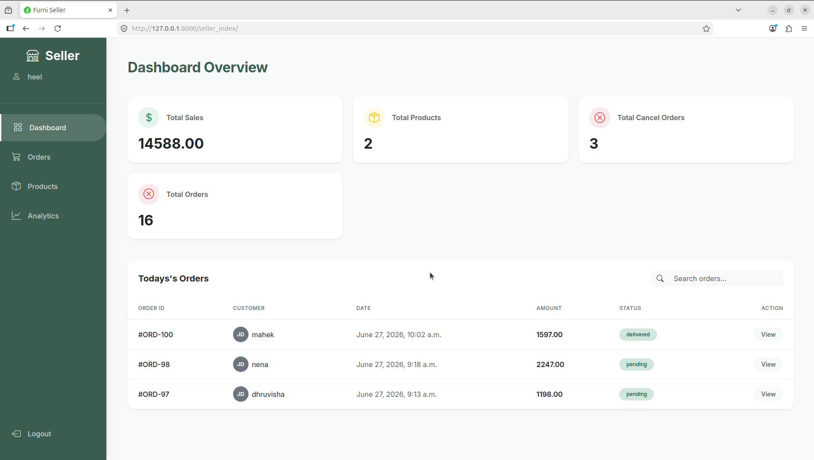

---

### 📋 Seller Orders

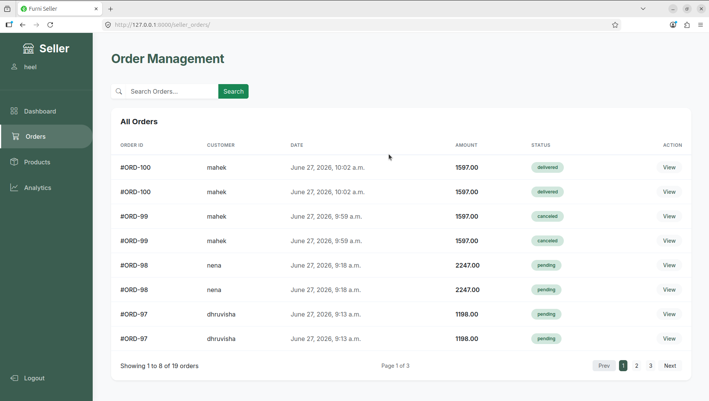

---

### 📦 Seller Products

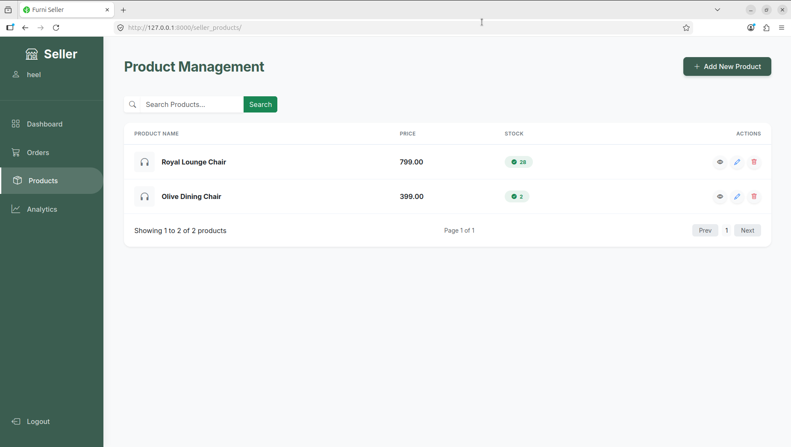

---

### 📊 Seller Analytics

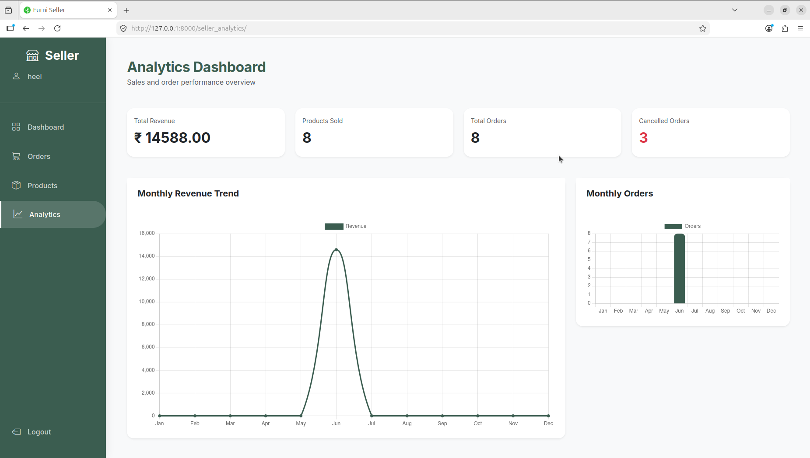

---

### 👤 Seller Profile

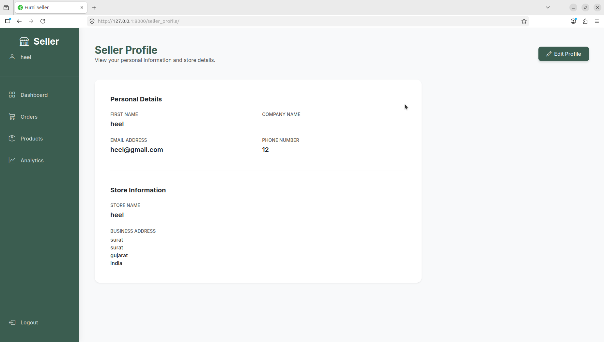

---

### 🛠️ Admin Dashboard

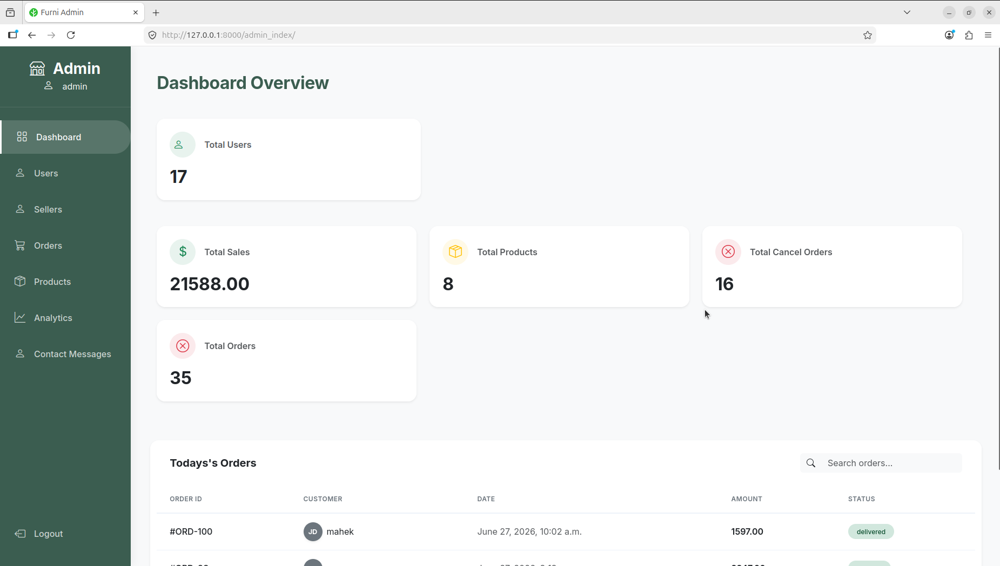

---

### 👥 Admin Users

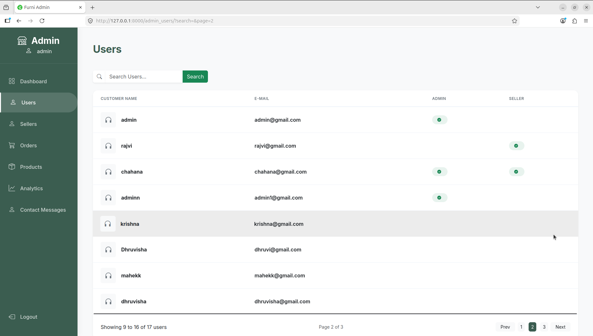

---

### 🏪 Admin Sellers

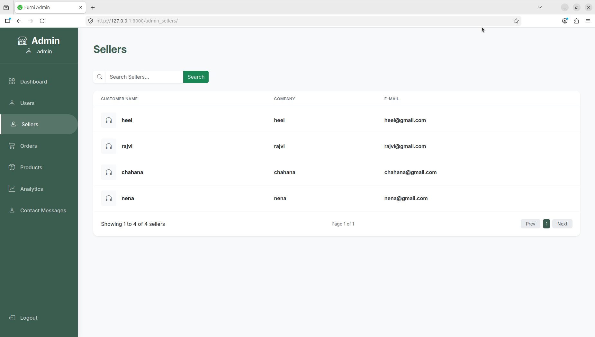

---

### 📦 Admin Orders

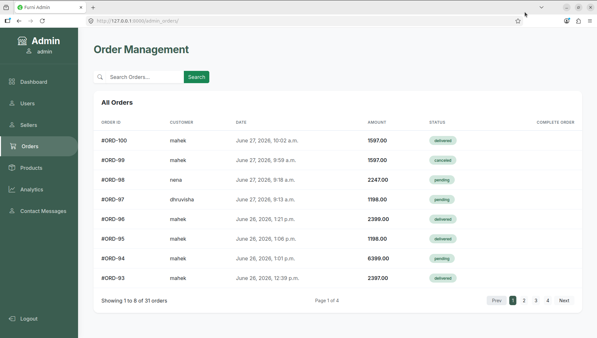

---

### 🛍️ Admin Products

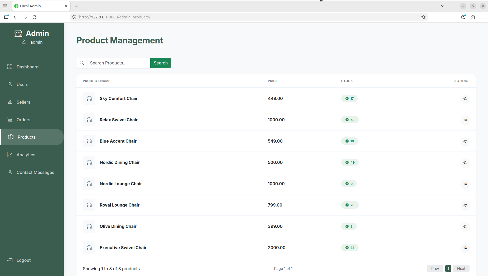

---

### 📈 Admin Analytics

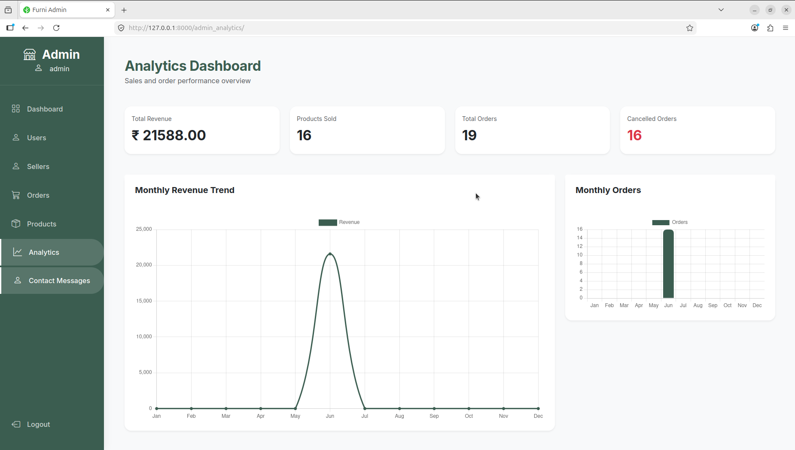

---

### 📩 Contact Messages

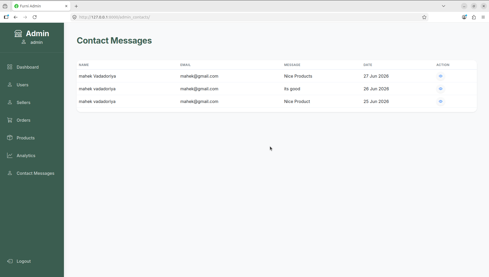